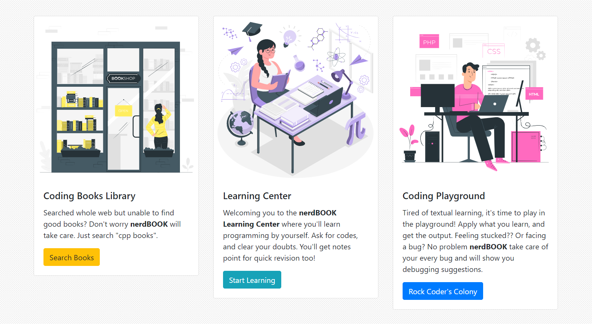
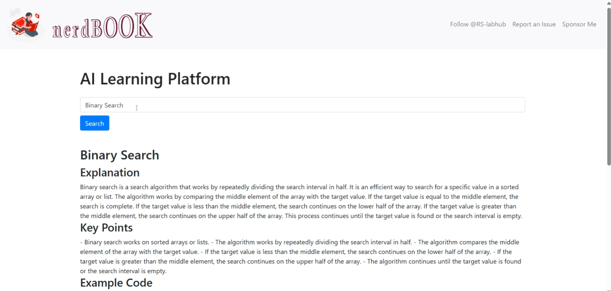

<p align="center">
    
    
</p>


<br>

# 🤓📖 nerdBOOK 
 **nerdBOOK** is a web application which lets learn programming featured with *cpp language*. You'll get books, ask your queries and learn from them, and last but not the least, you get a cpp code playground, where you can play with your codes and get debugging suggestions, if got any!

<br>

## 🪶 Features
- **Free CPP BOOKs** 📖: nerdBOOK will provides with different cpp books from OS building to Games development using CPP 🧑‍💻.
- **Learning Assistant** ✒️: Unable to understand a topic? Or want to revise with key points of the specific topics?? We made a learning assitant powered by *Minds DB* 🧠.
- **CPP Playground** 🚀: Learnt everything? Now it's time to test your skills! Go and play with codes in the playground. Getting bugs? Don't worry AI will tell you the debug suggestions 🥹

#

# :books: Index

- [Demo](#movie_camera-Demo)
- [Screenshots](#screenshots)
- [Set Up](#outbox_tray-Set-up)
- [Contribute](#building_construction-Contribute)
- [Project Author](#people_holding_hands-Meet-the-Author)
- [Contact](#email-contact)

#

#  :movie_camera: Demo
- After a brief introduction, let's dive a little more inside the project.
- Here is the walk-through of **nerdBOOK**. If you want to witness a more a hd version, [click here]()


<p align="center">Video Demonstration</p>

## Screenshots

<p align="center">
  
  <p align="center">Landing Page 📟</p>
  <br>
  <p align="center">
  
  <p align="center">nerdBOOK features 💽</p>
  <br>
  <p align="center">
  
  <p align="center">nerdBOOK BookShop 📚</p>
  <br>
  <p align="center">
  
  <p align="center">nerdBOOK Learning Assistant 🤖</p>
  <br>
  <p align="center">
  
  <p align="center">nerBOOk CPP Playground 🛝</p>
</p>

<br>


## Dependecies
1. **HTML**
2. *CSS*
3. **JavaScript**
4. *Bootstrap*
5. **Minds DB**
6. *Python*

#

##  :outbox_tray: Installation Guide
- These are the steps required to install and run the nerdBOOK project:


1. Clone the Repository: Open a terminal or command prompt and clone the nerdBOOK repository from GitHub using the following command:

  ```bash
    git clone https://github.com/RS-labhub/nerdBook
  ```

2. Navigate to the Repository Directory: Change your current directory to the cloned nerdBOOK repository:

  ```bash
    cd nerdBook
  ```

3. Install Dependencies: Use pip to install the required dependencies listed in the requirements.txt file:

  ```bash
    pip install -r requirements.txt
  ```

4. Run nerdBOOK application using the following command:

  ```py
    ctrl + shift + P
  ```

5. Once the application is running, enjoy it!.

<br>

> [!NOTE]
> Run node server.js and node compiler.js simulatenously in differently terminals.


## What to do after installation?
Once nerdBOOK is installed and running, you can use it to get your enhance your learning.

> [!IMPORTANT]
> REPLACE THE API KEY WITH YOUR API KEY, you can get it from here https://mdb.ai


$~$

# Setup and Contributing Guidelines
    
**Set Up Your Environment**

1. `Fork` our repository to your GitHub account. 
2. `Clone` your fork to your local machine. 
    Use the command `git clone https://github.com/RS-labhub/SeedLink-Shepherd.git`.
3. Create a new branch for your work. 
    Use a descriptive name, like `fix-login-bug` or `add-user-profile-page`.
    
**Commit Your Changes**

- Commit your changes with a _clear commit message_. 
  e.g `git commit -m "Fix login bug by updating auth logic"`.

**Submit a Pull Request**

- Push your branch and changes to your fork on GitHub.
- Create a pull request, compare branches and submit.
- Provide a detailed description of what changes you've made and why. 
  Link the pull request to the issue it resolves. 🔗
    
**Review and Merge**

- I will review your pull request and provide feedback or request changes if necessary. 
- Once your pull request is approved, we will merge it into the main codebase 🥳

$~$

## :people_holding_hands: Meet the Author


### :email: Contact 
- Email: rs4101976@gmail.com
- Head over to my github handle from [here](https://github.com/RS-labhub)

<br>

<p align="center">
<a href="https://twitter.com/rrs00179" target="blank"></a>
<a href="https://www.linkedin.com/in/rohan-sharma-9386rs/" target="blank"></a>
</p>

<br>

<p align="center">
   Thank you for visting this Repo <br>If you like it, <a href="https://github.com/RS-labhub/nerdBook/stargazers">star</a> ⭐ it
</p>
